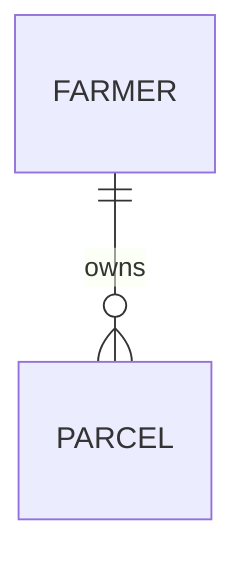

# Configuration Management Plan

## Farmers Registration Project - Form Specifications

**Version:** 0.2 (DRAFT)
**Last Updated:** 2026-01-06
**Status:** Under Review

---

## 1. Purpose

This document establishes the configuration management rules for all Joget DX form specifications in the Farmers Registration project. It defines folder structures, naming conventions, documentation requirements, and governance principles.

---

## 2. Foundational Principles

### 2.1 Joget-First Architecture

All data persistence and business logic MUST be implemented through Joget DX platform capabilities:

| Allowed | Prohibited |
|---------|------------|
| Joget Forms (entity definition) | Raw SQL DDL/DML |
| Joget Binders (data access) | Direct database access |
| Joget Process Flows (business logic) | Stored procedures |
| Joget API Builder (integrations) | Custom database scripts |
| Joget Plugins (extensions) | Schema migrations outside Joget |

**Rationale:** Joget forms ARE the entity model. Each form defines a database table, its columns (fields), relationships (foreign keys via SelectBox/Subform), and constraints (validators). This ensures:
- Platform consistency
- Audit trail preservation
- Upgrade compatibility
- Single source of truth

### 2.2 Terminology

| Term | Definition |
|------|------------|
| **Entity** | A Joget form that persists data (creates a database table) |
| **Form Model** | The collection of forms and their relationships within a module |
| **Component** | A functional grouping of related forms (e.g., farmer, parcel) |
| **Module** | A logical system boundary containing one or more components |

---

## 3. Module Structure

### 3.1 Top-Level Organization

```
specs/
├── CONFIGURATION_MANAGEMENT_PLAN.md   # This document
├── README.md                          # Quick reference guide
│
├── <module>/                          # System module (e.g., frs, imm, spm)
│   ├── <MODULE>_OVERVIEW.md           # System specification
│   ├── <MODULE>_FORM_MODEL.md         # Entity relationships
│   ├── <MODULE>_IMPLEMENTATION.md     # Implementation plan & status
│   │
│   ├── <component>/                   # Functional component
│   │   ├── <COMPONENT>_DESIGN.md      # Component design document
│   │   ├── input/                     # YAML specifications
│   │   ├── output/                    # Generated JSON forms
│   │   └── data/                      # Reference/seed data (CSV)
│   │
│   └── _archive/                      # Superseded specifications
│
├── mdm/                               # Master Data Management (shared)
├── gis/                               # GIS Integration (shared)
└── archive/                           # Deprecated modules
```

### 3.2 Module Types

| Type | Prefix | Description | Example |
|------|--------|-------------|---------|
| **Domain Module** | varies | Core business functionality | `frs/`, `imm/`, `spm/` |
| **Shared Module** | none | Cross-cutting, reusable | `mdm/`, `gis/`, `jre/` |
| **Archive** | `_archive/` | Historical reference | `frs/_archive/` |

---

## 4. Naming Conventions

### 4.1 Folders

| Element | Convention | Example |
|---------|------------|---------|
| Module | lowercase, 2-4 chars | `frs`, `imm`, `spm` |
| Component | lowercase, singular noun | `farm`, `parcel`, `campaign` |
| Standard subfolders | `input/`, `output/`, `data/` | Always these exact names |

### 4.2 Files

| Type | Convention | Example |
|------|------------|---------|
| YAML spec | `<formId>.yaml` | `frFarmer.yaml`, `frParcel.yaml` |
| Generated JSON | `<formId>.json` | `frFarmer.json` |
| Reference data | `<formId>.csv` | `md03district.csv` |
| Design docs | `<COMPONENT>_<TYPE>.md` | `PARCEL_DESIGN.md` |
| Module docs | `<MODULE>_<TYPE>.md` | `FRS_OVERVIEW.md` |

### 4.3 Form IDs

| Category | Pattern | Example |
|----------|---------|---------|
| MDM forms | `md<NN><EntityName>` | `md03district`, `md19crops` |
| FRS forms | `fr<EntityName>` | `frFarmer`, `frParcel` |
| IMM forms | `im<EntityName>` | `imCampaign`, `imAllocation` |
| SPM forms | `sp<EntityName>` | `spProgram`, `spApplication` |
| GIS forms | `gs<EntityName>` | `gsParcelBoundary` |

---

## 5. Documentation Requirements

### 5.1 Module-Level Documents

Every module MUST have:

| Document | Purpose | Required Sections |
|----------|---------|-------------------|
| `<MODULE>_OVERVIEW.md` | System specification | Scope, Actors, Business Rules, Dependencies |
| `<MODULE>_FORM_MODEL.md` | Entity relationships | Entity List, Relationship Diagram, Foreign Keys |
| `<MODULE>_CHANGELOG.md` | Version history | Releases with Added/Changed/Removed sections |

### 5.2 Component-Level Documents

Each component SHOULD have:

| Document | Purpose | When Required |
|----------|---------|---------------|
| `<COMPONENT>_DESIGN.md` | Detailed design | Components with 3+ forms |
| `<COMPONENT>_INTEGRATION.md` | External integration | When integrating with external systems (e.g., GIS) |

### 5.3 Form Model Documentation

The `<MODULE>_FORM_MODEL.md` MUST include:

```markdown
## Entities

| Form ID | Form Name | Table Name | Description |
|---------|-----------|------------|-------------|
| frFarmer | Farmer Registration | frFarmer | Core farmer entity |
| frParcel | Land Parcel | frParcel | Farmer's land holdings |

## Relationships

| Parent Entity | Child Entity | Relationship | Foreign Key Field |
|---------------|--------------|--------------|-------------------|
| frFarmer | frParcel | 1:N | farmerId |
| md03district | frFarmer | N:1 (lookup) | districtId |

## Entity Diagram

[ASCII or Mermaid diagram showing relationships]
```

---

## 6. Change Management

### 6.1 Versioning Philosophy

**Principle: Don't version what git already versions.**

Git automatically tracks every change to every file. Additional versioning is only needed for:
- Marking release points (what's imported to Joget vs work-in-progress)
- Human-readable history explaining business meaning of changes
- Grouping related changes across multiple files

**What we version:**

| Level | Mechanism | Example |
|-------|-----------|---------|
| Individual files | Git history (automatic) | `git log frFarmer.yaml` |
| Module releases | Git tags | `git tag frs-v1.1.0` |
| Human history | `<MODULE>_CHANGELOG.md` | "Added parcel support" |

**What we do NOT version:**
- No version numbers inside YAML spec files
- No separate version tracking database

### 6.2 Semantic Versioning (SemVer)

Modules follow `MAJOR.MINOR.PATCH` versioning:

| Change Type | Bump | Example | When to Use |
|-------------|------|---------|-------------|
| **MAJOR** | X.0.0 | 1.0 → 2.0 | Breaking: renamed form ID, removed required field, changed FK |
| **MINOR** | 0.X.0 | 1.0 → 1.1 | Feature: new form, new optional field, new component |
| **PATCH** | 0.0.X | 1.1 → 1.1.1 | Fix: validation fix, label typo, default value change |

### 6.3 Change Workflow

```
┌─────────────────┐     ┌─────────────────┐     ┌─────────────────┐
│  1. SPECIFY     │────▶│  2. IMPLEMENT   │────▶│  3. RELEASE     │
│                 │     │                 │     │                 │
│ Create change   │     │ Edit YAML specs │     │ Tag in git      │
│ spec doc        │     │ directly in     │     │ Update CHANGELOG│
│ (optional)      │     │ input/ folder   │     │ Import to Joget │
└─────────────────┘     └─────────────────┘     └─────────────────┘
        │                                               │
        │         ┌─────────────────┐                   │
        └────────▶│  4. CLEANUP     │◀──────────────────┘
                  │                 │
                  │ Delete or       │
                  │ archive change  │
                  │ spec doc        │
                  └─────────────────┘
```

**Step details:**

1. **SPECIFY** (optional, for significant changes)
   - Create: `<MODULE>_CHANGE_<short-name>.md` in module folder
   - Document: what's changing, why, affected forms
   - Skip for: trivial fixes, single-field additions

2. **IMPLEMENT**
   - Edit YAML files directly in `<component>/input/` folder
   - Use git branch for large/experimental changes: `feature/frs-multi-parcel`
   - Commit with meaningful messages (see Section 6.5)

3. **RELEASE**
   - Create git tag: `git tag <module>-v<version>`
   - Update `<MODULE>_CHANGELOG.md` with release notes
   - Import generated JSON to Joget

4. **CLEANUP**
   - Delete change spec doc (git history preserves it)
   - Or move to `_archive/changes/` if keeping for reference

### 6.4 Git Workflow

**For small changes (no branch):**
```bash
# Edit specs
vim specs/frs/farm/input/frFarmer.yaml

# Validate
joget-form-gen validate specs/frs/farm/input/frFarmer.yaml

# Commit
git add specs/frs/
git commit -m "feat(frs): Add phone number field to farmer form"

# When ready to release
git tag frs-v1.1.0
```

**For large changes (use branch):**
```bash
# Create branch
git checkout -b feature/frs-multi-parcel

# Make changes, commit incrementally
git commit -m "feat(frs): Create parcel component structure"
git commit -m "feat(frs): Add frParcel form spec"
git commit -m "refactor(frs): Remove land fields from frFarmer"

# Merge when complete
git checkout main
git merge feature/frs-multi-parcel

# Tag release
git tag frs-v1.1.0
```

### 6.5 Commit Message Format

Follow conventional commits for clarity:

```
<type>(<module>): <short description>

[optional body with details]
```

**Types:**

| Type | Usage |
|------|-------|
| `feat` | New form, new field, new component |
| `fix` | Bug fix, validation correction |
| `refactor` | Restructure without behavior change |
| `docs` | Documentation only |
| `chore` | Maintenance, cleanup |

**Examples:**
```
feat(frs): Add parcel component for multi-land support
fix(imm): Correct validation on allocation quantity field
refactor(spm): Split eligibility into separate component
docs(frs): Update form model with parcel relationships
```

### 6.6 Archive Policy

| Scenario | Action |
|----------|--------|
| Form superseded by new design | Move to `<module>/_archive/` |
| Component restructured | Create dated subfolder: `_archive/2026-01/` |
| Module deprecated | Move entire module to `specs/archive/` |
| Change spec after implementation | Delete (git preserves) or move to `_archive/changes/` |

---

## 7. Quality Gates

### 7.1 Specification Validation

Before generating JSON:
```bash
joget-form-gen validate <spec>.yaml
```

### 7.2 Checklist Before Commit

- [ ] YAML validates without errors
- [ ] Form ID matches file name
- [ ] Form ID matches tableName
- [ ] No system-managed fields (id, createdBy, modifiedBy, etc.)
- [ ] MDM forms have `code` and `name` fields
- [ ] Foreign key fields reference valid parent forms
- [ ] Component design doc updated (if applicable)

---

## 8. Current Module Inventory

| Module | Description | Status | Components |
|--------|-------------|--------|------------|
| `mdm/` | Master Data Management | Active | (shared reference data) |
| `frs/` | Farmer Registration System | Planning | farm, parcel |
| `imm/` | Input Management Module | Active | campaign, allocation, distribution |
| `spm/` | Social Protection Module | Active | program, application, eligibility |
| `gis/` | GIS Integration | Planning | (shared spatial services) |
| `jre/` | Joget Rules Engine | Active | rules, fields, scopes |

---

## Appendix A: Document Templates

### A.1 Module Overview Template

```markdown
# <MODULE> - System Overview

**Module:** <Full Name>
**Version:** 1.0
**Last Updated:** YYYY-MM-DD

## 1. Scope

[What this module covers and its boundaries]

## 2. Actors

| Actor | Description |
|-------|-------------|
| ... | ... |

## 3. Business Rules

- BR-001: [Rule description]

## 4. Dependencies

| Dependency | Type | Description |
|------------|------|-------------|
| mdm/ | MDM Lookup | Master data references |

## 5. Out of Scope

[What this module explicitly does NOT cover]
```

### A.2 Form Model Template

```markdown
# <MODULE> - Form Model

## Entities

| Form ID | Form Name | Description |
|---------|-----------|-------------|

## Relationships

| Parent | Child | Type | FK Field |
|--------|-------|------|----------|

## Relationship Diagram


```

### A.3 Component Design Template

```markdown
# <COMPONENT> - Design Document

**Component:** <name>
**Module:** <parent module>

## 1. Purpose

[What this component does]

## 2. Forms

| Form ID | Purpose |
|---------|---------|

## 3. Field Specifications

[Key fields and their business rules]

## 4. Integration Points

[How this component connects to others]
```

### A.4 Changelog Template

```markdown
# <MODULE> Changelog

All notable changes to this module are documented in this file.

Format based on [Keep a Changelog](https://keepachangelog.com/).
This module follows [Semantic Versioning](https://semver.org/).

## [Unreleased]

### Added
- (changes in development, not yet released)

## [1.1.0] - 2026-01-15

### Added
- frParcel: Land parcel entity for multi-land support
- GIS coordinate capture fields on parcel form

### Changed
- frFarmer: Removed embedded land fields (moved to frParcel)

### Fixed
- frFarmer: Phone number validation regex

## [1.0.0] - 2025-12-01

### Added
- frFarmer: Initial farmer registration form
- Basic MDM lookups (district, language)
```

**Section types:**
- **Added** - new forms, fields, components
- **Changed** - modifications to existing forms
- **Deprecated** - features to be removed in future
- **Removed** - deleted forms or fields
- **Fixed** - bug fixes
- **Security** - vulnerability fixes

### A.5 Change Specification Template

Use for significant changes. File name: `<MODULE>_CHANGE_<short-name>.md`

```markdown
# Change Specification: <Short Title>

**Module:** <module>
**Date:** YYYY-MM-DD
**Status:** Draft | In Progress | Implemented | Cancelled

## 1. Summary

[One paragraph describing the change]

## 2. Motivation

[Why is this change needed? Business driver or problem being solved]

## 3. Affected Forms

| Form ID | Change Type | Description |
|---------|-------------|-------------|
| frFarmer | Modified | Remove land fields |
| frParcel | New | New entity for land holdings |

## 4. Form Model Changes

[Describe relationship changes, new FKs, etc.]

## 5. Migration Notes

[Any data migration considerations, if applicable]

## 6. Dependencies

[Other modules or components affected]
```

---

## Revision History

| Version | Date | Author | Changes |
|---------|------|--------|---------|
| 0.2 | 2026-01-06 | Claude Code | Simplified change management: git-based versioning, CHANGELOG template |
| 0.1 | 2026-01-06 | Claude Code | Initial draft |
